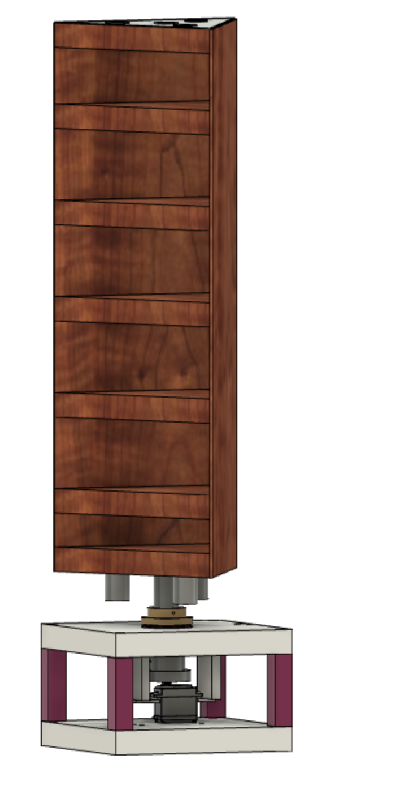

# Panel Design

This subdirectory contains images, STLs, and Adobe Illustrator files for laser cutting. Wood was chosen as a base material for the panel design, as it is easily manufacturable, and provides a solid base for the attachment of different materials, such as ceramic, melamine foam, or standard wedged acoustic foams.

## Explanation of Design Choices

The above image shows the CAD model of the panel. The base component is composed of three 3D printed components. The lowermost component is designed for attachment with HFS5 20x20 Aluminum rail [Rail](https://us.misumi-ec.com/vona2/detail/110302683830/?list=PageCategory), and the top component includes a frame for a Gobilda servo motor [Motor](https://www.gobilda.com/2000-series-dual-mode-servo-25-2-torque/) and holster for a ball bearing[bearing](https://www.mcmaster.com/products/ball-bearings/flanged-ball-bearings-7/for-shaft-diameter~1/). These two components are attached together by 3D printed columns. A similar assembly is located at the top of the panels, where another bearing is located to maintain alignment on a common axis.
