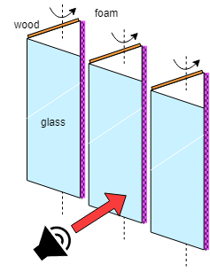
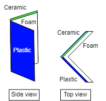
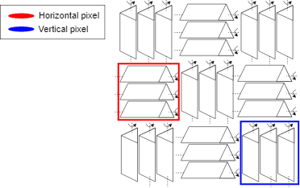
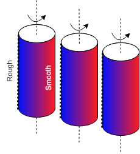
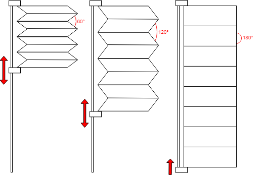
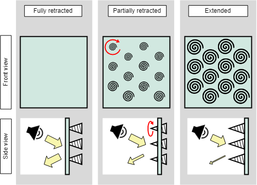

# MARS Reverb
Goal: Adjustable reverb using robots. Figuring out how to control reverb will be an iterative process of building alterable surfaces/panels/bricks, then taking reverb measurements.

For now, we will measure the reverb using the RT60 measurement.

## Project Timeline
Many possible designs have already been proposed by several people. The major ones are described below

### 0. Blinds
> Completed Winter 2021

Simple window blinds were used to obstruct acoustic foam. Measurement results showed very slight changes to reverb - not enough to be especially useful.

### 1. Panels
> Current Priority

The basic idea is to have triangular prisms where each major face has a different material.

The ability to manually change the material (i.e. by mounting panels onto a base prism) may be helpful for material selection.

Another interesting idea is to hollow out the triangular prism, so that the cavity provides a similar effect to standard acoustic foam padding.

Note that the materials labelled here were chosen at random.

### 2. Pixels
Above designs only have vertical grooves. Horizontal grooves are necessary too.

### 3. Columns
It may be possible to achieve a wide spread of reverb values using cylinders with a gradual change in texture.

This would almost certainly need to be fabricated using 3D printers.

### 4. Folding

Similar to the panel design with cavities, however instead of rotating this would involve changing the inner angle of the cavity, rather than having it fixed at 60 degrees (as the triangular prisms of the panel idea should have equilateral cross-section)

### 5. Spirals

Corkscrew-like protrusions that extend out from a flat surface.

